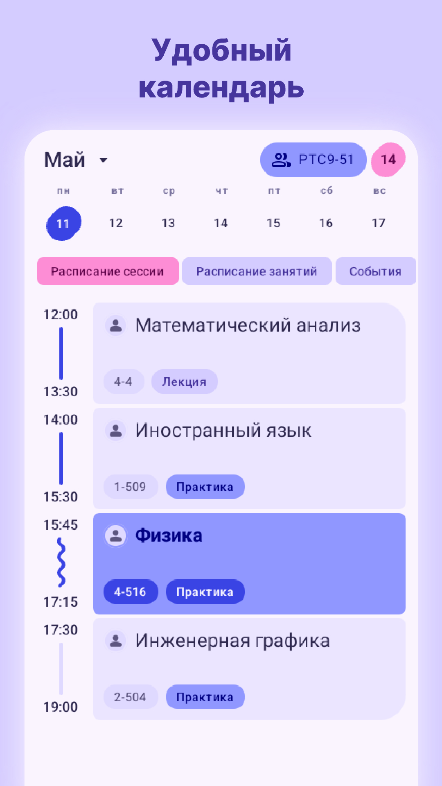
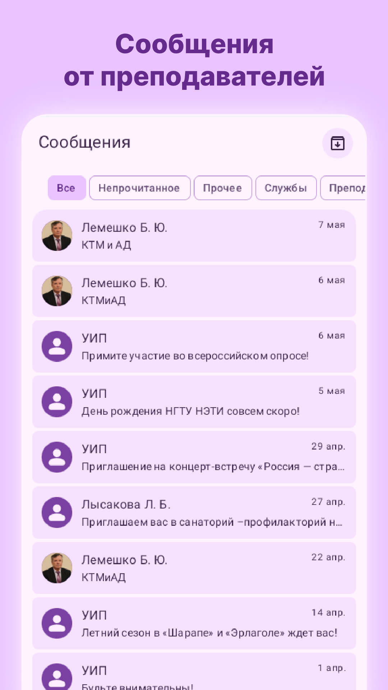
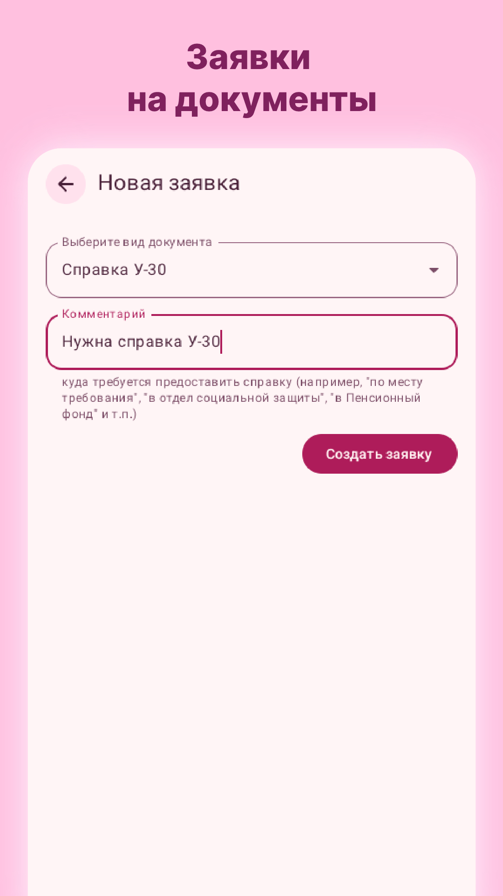
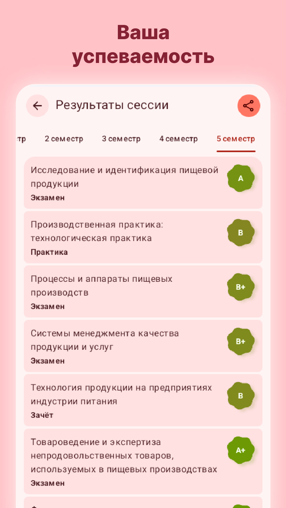
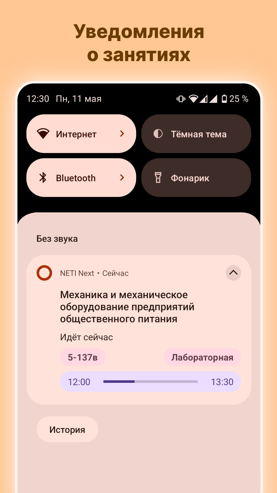
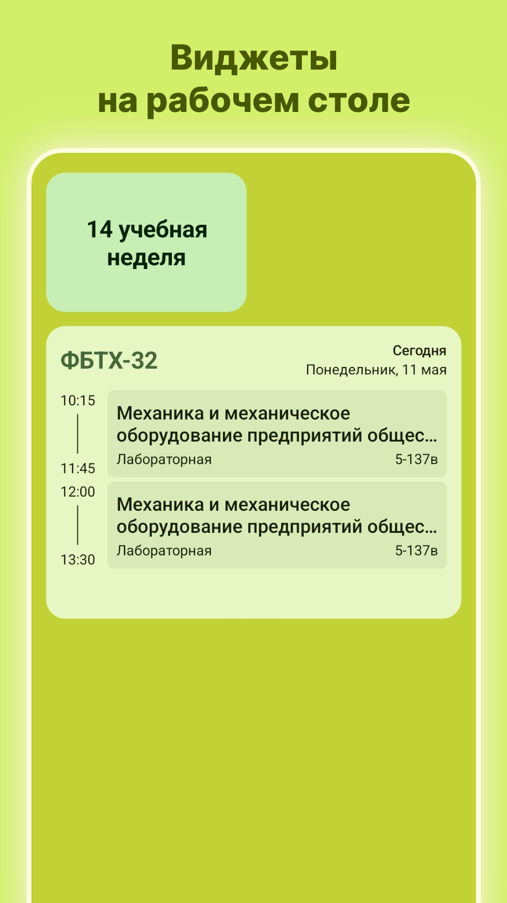
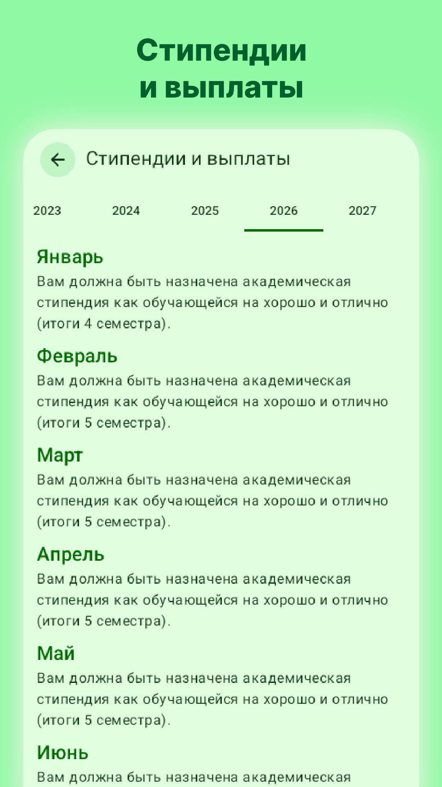

  

# NETI Next

**NETI Next** is an unofficial open-source application for NSTU (NETI) students, created by students of this institution!

**Important:** _This application is not an official application of NSTU (NETI) and does not try to impersonate it. The application is developed and maintained by an independent developer._

The application supports login to the student's personal account. This allows you to view messages from teachers and services, your gradebook, as well as information about scholarships and payments.

### Some features of the application:

**🔹 University News Feed:**
Important news, announcements, and university events are collected here.

**🔹 Calendar:**
Add your study group and keep track of your class and exam schedules.

**🔹 Messages:**
You can view messages from the dean's office, teachers, and university services.

**🔹 Scholarships and Payments:**
Information about assigned scholarships and payments.

**🔹 Document Requests:**
You can request certificates and documents and track their status directly in the app.

**🔹 Exam Results:**
Track your academic progress; the app will show your gradebook.

**🔹 Class Notifications:**
Show current and upcoming classes in the notification panel.

**🔹 Home Screen Widgets:**
You can add a schedule widget to your home screen.

**🔹 Themes:**
Customize the app to your liking by choosing a color scheme and element shapes.

**🔹 Wear OS Support:**
View your class schedule on your smartwatch.

## Screenshots

  
  
  
  

  
  
  
  

The application is under active development. You can send your feedback, suggestions, and bug reports to the developer.
