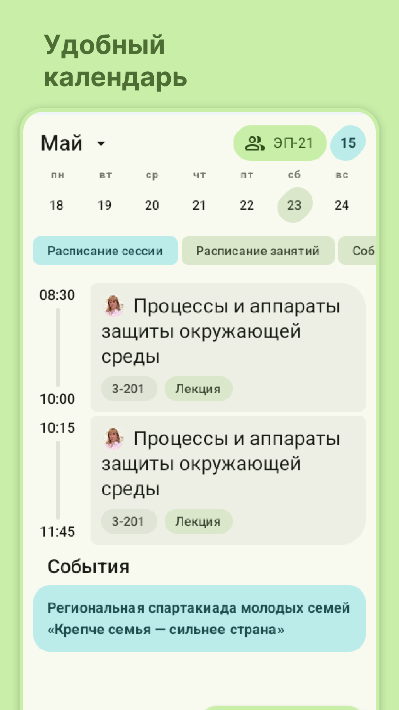
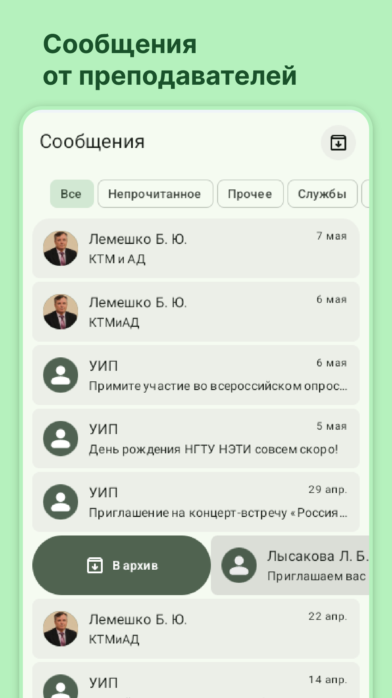
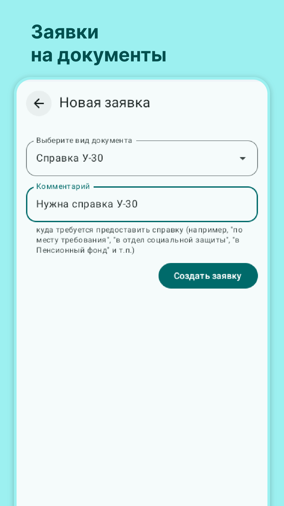
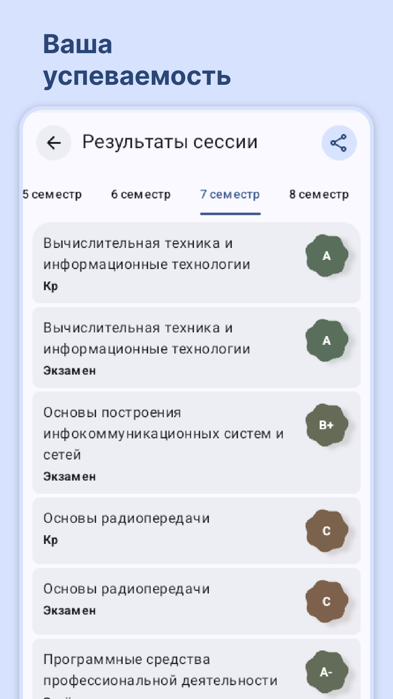
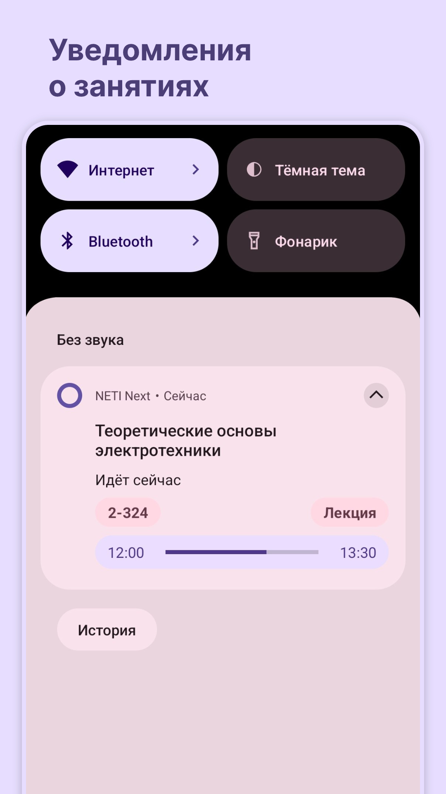
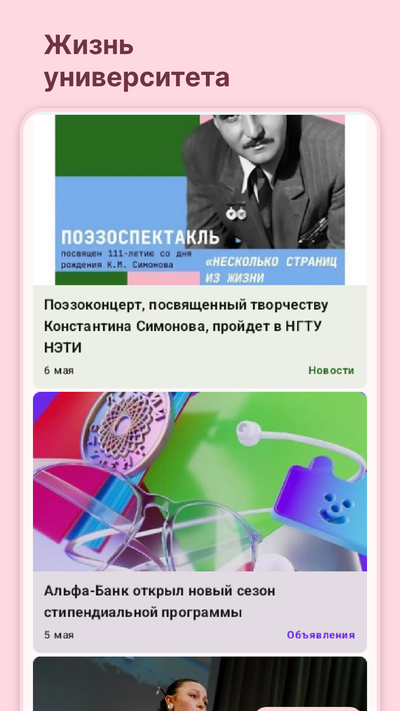
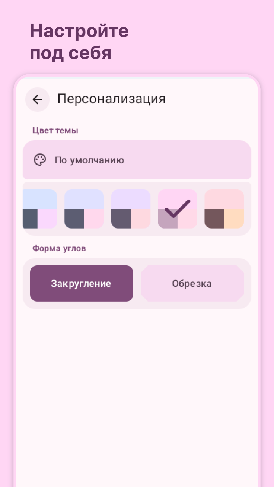

# NETI Next

**NETI Next** - это неофициальное приложение с открытым исходным кодом для студентов НГТУ (НЭТИ), созданное студентами этого учебного заведения!

**Важно:** _Данное приложение не является официальным приложением университета НГТУ (НЭТИ) и не пытается выдавать себя за него.
Приложение разрабатывается и поддерживается независимым разработчиком._

Приложение поддерживает авторизацию в личном кабинете студента. Благодаря этому вы сможете просматривать сообщения от преподавателей и служб, вашу зачетку, а также информацию о стипендиях и выплатах. 

### Некоторый функционал приложения:

**🔹 Новостная лента университета:**
Здесь собраны важные новости, объявления и события университета

**🔹 Календарь:**
Добавьте учебную группу и следите за расписанием занятий и расписанием сессии

**🔹 Сообщения:**
Вы можете просматривать сообщения от деканата, преподавателей и служб университета

**🔹 Стипендии и выплаты:**
Информация о назначенных стипендиях и выплатах

**🔹 Заявки на документы:**
Вы можете оформлять заявки на получение справок и документов и отслеживать статус заявки прямо в приложении

**🔹 Результаты сессии:**
Следите за успеваемостью, приложение покажет вашу зачётку

**🔹 Уведомления о занятиях:**
Показывать в панели уведомлений текущие и будущие пары

**🔹 Виджеты на рабочем столе:**
Вы можете добавить виджет с расписанием на главный экран

**🔹 Темы оформления:**
Настройте приложение под себя, выбрав цветовую схему, а также форму элементов

**🔹 Поддержка Wear OS:**
Просматривайте расписание занятий на умных часах

## Скриншоты

  
  
  

  
  
  

  

Приложение находится в активной разработке. Свои отзывы, предложения, а также отчёты об ошибках вы можете отправить разработчику приложения
